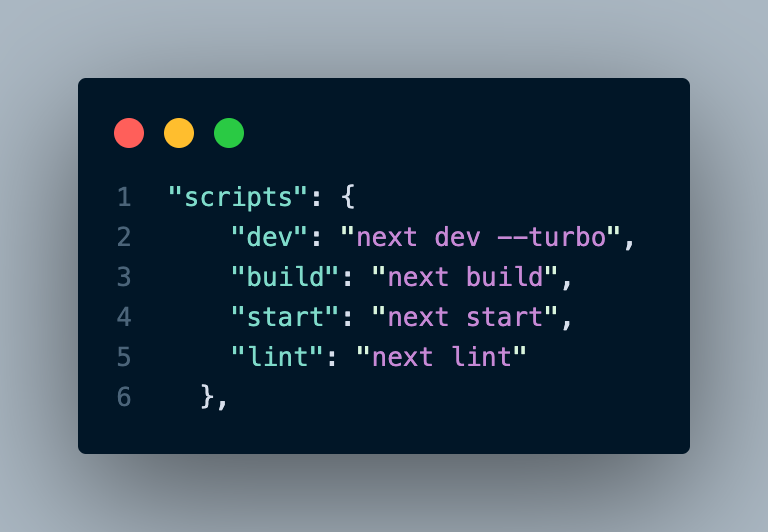
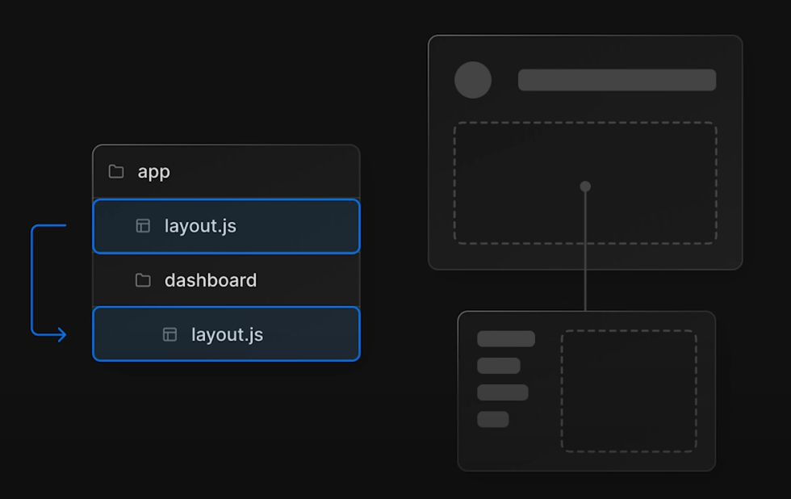
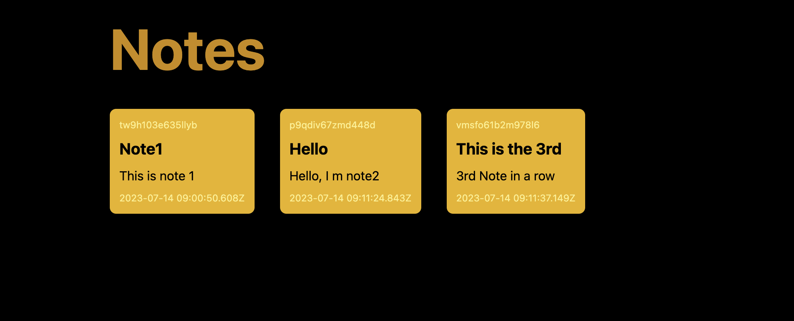
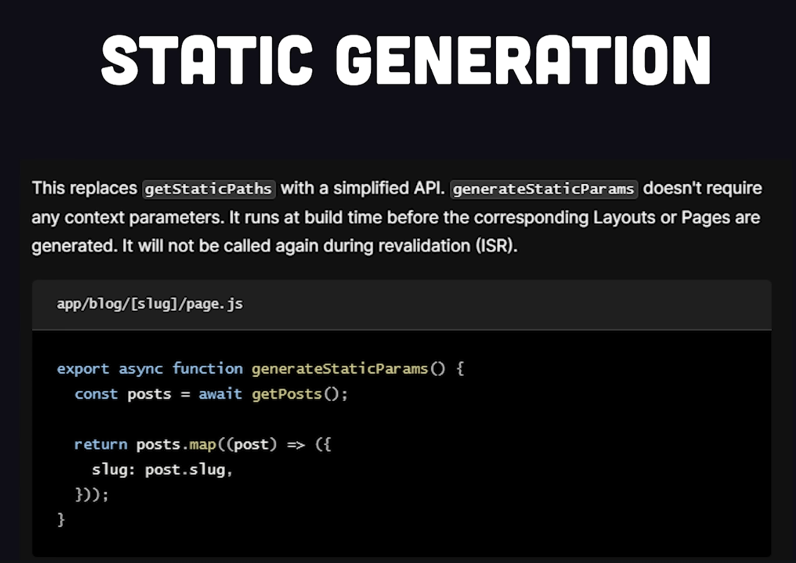

# NextJS 13

## Routing

New routing works with App directory. Instead of pages directory now we have an ./app directory in the root folder, that contains all our diferent route pages.

app/page.tsx -> index page  -> http://localhost:3000

#### Folder based routes
app/about/page.tsx -> about page -> http://localhost:3000/about

#### Dynamic routes
app/articles/[slug]/page.tsx -> dynamic article page by slug -> http://localhost:3000/articles/[slug]

#### Ignored files by routing system
(group)

app/(marketing) <- ignored by routing system, cannot access by http://localhost:3000/marketing


### Reserved Files
- page.tsx
- layout.tsx
- loading.tsx
- error.tsx
- template.tsx
- head.tsx


#### Use new build tool Turbopack
Webpack written in Rust - Currently in Alpha




### Layouts

Create a layout.tsx file, it should contain navbar & footer.


We can fetch in layouts too. Layouts are server components by default.

```js
import './globals.css'
import type { Metadata } from 'next'
import { Inter } from 'next/font/google'

const inter = Inter({ subsets: ['latin'] })

export const metadata: Metadata = {
  title: 'Create Next App',
  description: 'Generated by create next app',
}

export default function RootLayout({
  children,
}: {
  children: React.ReactNode
}) {
  return (
    <html lang="en">
      <body className={inter.className}>{children}</body>
    </html>
  )
}
```

Layouts can be nested:



### Route with Link component

First, create a Link that goes to /notes route.

```js
import Link from 'next/link'

export default function Home() {
  return (
    <main className="flex min-h-screen flex-col items-center justify-between p-24">
      <div className="z-10 w-full max-w-5xl items-center justify-between font-mono text-sm lg:flex">
        <Link href="/notes">Notes</Link>
      </div>
    </main>
  )
}
```

Second, create a notes folder in the app directory -> app/notes
Then create a page.tsx in the notes folder.

We can name it how we like forexample NotesPage. It can be an async arrow or normal function.

```js
import React from 'react'

export const NotesPage = async () => {
  return (
    <div>
      <h1>Notes</h1>
    </div>
  )
}
```

```js
export default async function NotesPage = () => {
  return (
    <div>
      <h1>Notes</h1>
    </div>
  )
}
```

### Server - Client components

Nextjs components are server components by default. Which means they get rendered on the server, we can do data fetching on the server & Render result on Client components || Server components

```js
import React from 'react'

const getNotes = async () => {
  const res = await fetch('http://127.0.0.1:8090/api/collections/notes/records');
  const data = await res.json();
  return data?.items as any[];
}

const NotesPage = async () => {
  const notes = await getNotes()

  return (
    <div className=''>
      <h1>Notes</h1>
      {JSON.stringify(notes)}
    </div>
  )
}

export default NotesPage
```

To paginate with pocketbase

```js
const getNotes = async () => {
  const res = await fetch('http://127.0.0.1:8090/api/collections/notes/records?page=1&perPage=30');
  const data = await res.json();
  return data?.items as any[];
}
```

To render out the Notes:

```js
const NotesPage = async () => {
  const notes = await getNotes()

  return (
    <div className=''>
      <h1>Notes</h1>
      <div>
        {notes?.map((note)=>{
          return <Note key={note.id} note={note} />
        })}
      </div>
    </div>
  )
}

const Note = ({note}: any) => {
  const {id, title, content, created} = note || {}

  return (
    <Link href={`/notes/${id}`}>
      <p>{id}</p>
      <h2>{title}</h2>
      <p>{content}</p>
      <p>{created}</p>
    </Link>
  )
}
```

On /notes page:



### <b style="color:red;">!Important to Know!</b>

Next will automatically cache this page because the route segment is not dynamic.
In other words, it treated like a static page. What we can do about it, is to change cache by adding 'no store' in fetch options.

Now it will refetch the items from the server on every request.

Its roughly the equivalent of getServerSideProps.

```js
const res = await fetch('http://127.0.0.1:8090/api/collections/notes/records?page=1&perPage=30',{
  cache: 'no-store'
});
```

We don't need to use fetch here, we can use PocketBase built in sdk.
```js
import PocketBase from 'pocketbase'

const getNotes = async () => {
  const db = new PocketBase('http://127.0.0.1:8090')
  const data = await db.collection('notes').getList()
  return data?.items as any[]
}
```

But now how do we change the caching behaviour?

Next 13 also has a varity of variables that we can export from the page to change behaviours of caching or runtime.

```js
export const dynamic = 'auto',
dynamicParams = true,
revalidate = 0,
fetchCache = 'auto',
runtime = 'nodejs',
preferredRegion = 'auto'
```


## Dynamic routes

Next step to create a dynamic route for the specific note by ID.

Create an [id] folder under app/notes, then create a page.tsx inside.

It will also be an async function

```js
const NotePage = async () => {

  return (
    <div>page</div>
  )
}

export default NotePage
```

Lets use the fetch function again to fetch note by id.

```js
const res = await fetch(`http://127.0.0.1:8090/api/collections/notes/records/${noteId}?page=1&perPage=30`,{
  next: {
    revalidate: 10 // Incremental Static Regeneration: https://nextjs.org/docs/pages/building-your-application/data-fetching/incremental-static-regeneration
  }
});
```

### ISR - Incremental Static Regeneration

- Any requests to the page after the initial request and before 10 seconds are also cached and instantaneous.
- After the 10-second window, the next request will still show the cached (stale) page
- Next.js triggers a regeneration of the page in the background.
- Once the page generates successfully, Next.js will invalidate the cache and show the updated page. If the background regeneration fails, the old page would still be unaltered.


## Prerender a page

If we want to prerender a page, then use generateStaticParams. Its an equivalent function of getStaticPaths & previous versions of Next.




## Loading State

With the new app route system we can create a reserved file loading.tsx that handles loading for us.

app/notes/[id]/loading.tsx

```js
import React from 'react'

const NoteLoadingPage = () => {
  return (
    <div className="animate-pulse flex justify-center items-center">
        <p className="text-3xl">Loading . . .</p>
    </div>
  )
}

export default NoteLoadingPage
```

## Error state

Same with Error

```js
'use client' // Error components must be Client Components

import { useEffect } from 'react'

export default function Error({
  error,
  reset,
}: {
  error?: Error
  reset?: () => void
}) {
  useEffect(() => {
    // Log the error to an error reporting service
    console.error(error)
  }, [error])

  return (
    <div>
      <h2>Something went wrong! {error?.message}</h2>
      <button
        onClick={
          // Attempt to recover by trying to re-render the segment
          () => reset?.()
        }
      >
        Try again
      </button>
    </div>
  )
}
```


## Mutate data with Next Client components

So far we looked at data fetching.

For mutating data, create a client component.

in app/notes directory create a CreateNode component for the form

Make it a client component with 'use client' flag so we can send requests inside the component.

```js
'use client'
import { useRouter } from 'next/navigation'
import React, { useState } from 'react'

export default function CreateNote() {
  const [title, setTitle] = useState('')
  const [content, setContent] = useState('')

  return (
    <form className='space-y-5 flex flex-col w-96' onSubmit={create}>
      <h1 className='text-4xl font-bold text-yellow-600 drop-shadow-lg shadow-blue-500'>Create a new Notes</h1>
      <input
        className='text-black'
        type='text'
        placeholder='Title'
        value={title}
        onChange={(e)=>setTitle(e.target.value)}
      />
      <input
        className='text-black'
        type='text'
        placeholder='Content'
        value={content}
        onChange={(e)=>setContent(e.target.value)}
      />
      <button disabled={!title || !content} className="p-3 disabled:bg-gray-400 rounded-full text-black bg-yellow-600 hover:bg-yellow-500">Submit</button>
    </form>
  )
}
```

Then create a fetch request to mutate notes collection on PocketBase.
Note: use next useRouter from next/navigation then refresh the page after a note creation.

```js
  const router = useRouter()

  const create = async() => {
    await fetch('http://127.0.0.1:8090/api/collections/notes/records', {
      method: 'POST',
      headers: {
        'Content-Type': 'application/json'
      },
      body: JSON.stringify({
        title,
        content
      })
    });

    setTitle('')
    setContent('')

    router.refresh()
  }
```